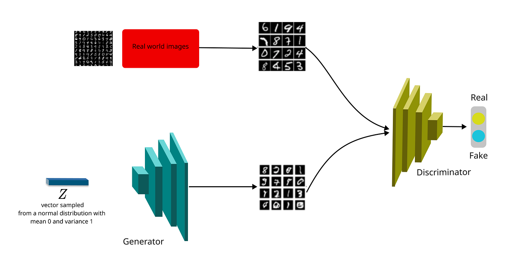

# Handwritten Digits Generator

This Jupyter notebook showcases the implementation of a Generative Adversarial Network (GAN) using TensorFlow to generate realistic handwritten digits. The project utilizes the classic MNIST dataset and explores deep learning techniques to understand the dynamics of generative models.




## Prerequisites

To run this notebook, you will need:
- Python 3.6 or above
- TensorFlow 2.x
- imageio
- matplotlib
- PIL
- numpy

Install the necessary packages using:
```bash
pip install tensorflow imageio matplotlib PIL numpy tensorflow-docs
```

## Notebook Overview

### 1. Setup
- **Installation:** Installs all required libraries.
- **Imports:** Importing necessary libraries and configuring the environment.

### 2. Hyperparameters
- **Configuration:** Setting up hyperparameters like buffer size, batch size, noise dimension, and learning rate for the training process.

### 3. Data Preparation
- **Loading Data:** The MNIST dataset is loaded and preprocessed for training.

### 4. Model Architecture
- **Generator:** Constructs a generator network that takes noise as input and outputs images resembling handwritten digits.
- **Discriminator:** Builds a discriminator network that classifies images as real (from the dataset) or fake (generated by the generator).

### 5. Training Process
- **Training Loop:** Detailed explanation of the training loop where the generator and discriminator compete against each other, improving through epochs.

### 6. Results and Visualization
- **Output Visualization:** Visualizing the improvements in generated images over training epochs.

## How to Run

To execute the notebook:
1. Clone the repository.
2. Open the notebook in Jupyter or any compatible IDE.
3. Run the cells sequentially to observe the model training and digit generation.

## Contributing

Contributions, bug fixes, and feature enhancements are welcome! Please fork the repository and submit pull requests for review.

## License

Distributed under the MIT License. See `LICENSE` for more information.
